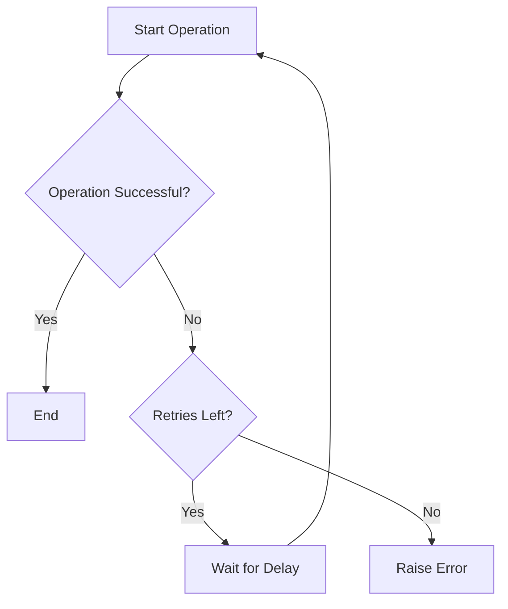

# SidekiqRetryStrategy

SidekiqRetryStrategy is a Ruby gem designed to provide a customizable retry strategy for handling operations that may fail temporarily. With this gem, you can easily integrate retry logic into your application, ensuring that transient errors are retried efficiently.

## Installation

Install the gem and add it to your application's Gemfile by executing:

```bash
$ bundle add sidekiq_retry_strategy
```

If Bundler is not being used to manage dependencies, install the gem manually by executing:

```bash
$ gem install sidekiq_retry_strategy
```

## Compatibility

This gem is compatible with Rails 8.0 and later. For earlier versions of Rails, use version `0.1.x` of this gem.

## Usage

### Basic Usage Example

Here’s an example of how you can use the SidekiqRetryStrategy in a service class:

```ruby
require 'sidekiq_retry_strategy'

class ExampleService
  include SidekiqRetryStrategy::Strategies::DefaultRetry

  def perform_operation
  ...
  end
end

service = ExampleService.new
service.perform_operation
```


This will retry the block of code up to 5 times with depending on which retry strategy is selected.

### Advanced Usage: Overriding Methods

If you need to override the default behavior, such as custom logging or dynamic retry logic, you can override the `retry_with_strategy` method.

```ruby
class CustomRetryService
  include SidekiqRetryStrategy

  def retry_with_strategy(retries:, delay:)
    super(retries: retries, delay: delay) do
      puts "Custom logic before retry"
      yield
      puts "Custom logic after retry"
    end
  end

  def perform_operation
    retry_with_strategy(retries: 5, delay: 1) do
      # Your custom retryable operation
      puts "Trying operation with custom retry..."
      raise "Custom transient error" if rand < 0.5
      puts "Custom operation succeeded!"
    end
  end
end

custom_service = CustomRetryService.new
custom_service.perform_operation
```

### Graphic Representation

The following diagram illustrates the retry logic implemented by SidekiqRetryStrategy:



## Development

After checking out the repository, set up the development environment by running:

```bash
$ bin/setup
```

Run the tests using:

```bash
$ rake spec
```

To experiment with the gem in an interactive environment, run:

```bash
$ bin/console
```

To install this gem onto your local machine, use:

```bash
$ bundle exec rake install
```

To release a new version:

1. Update the version number in `version.rb`.
2. Run:

```bash
$ bundle exec rake release
```


